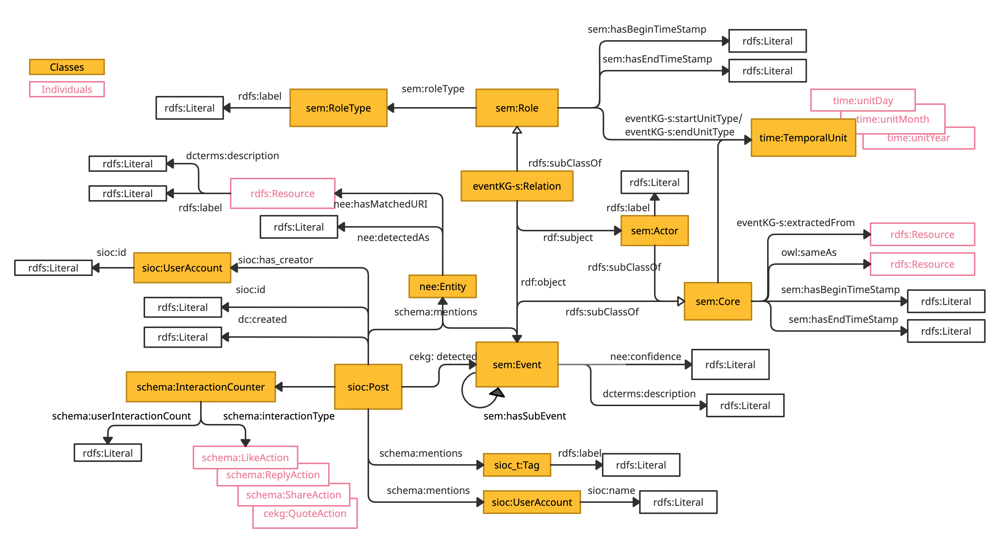
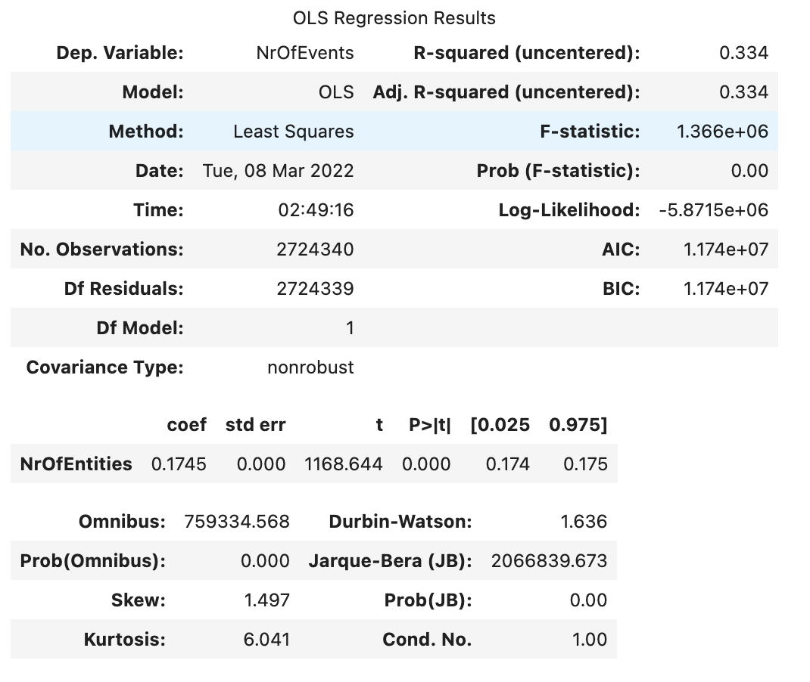
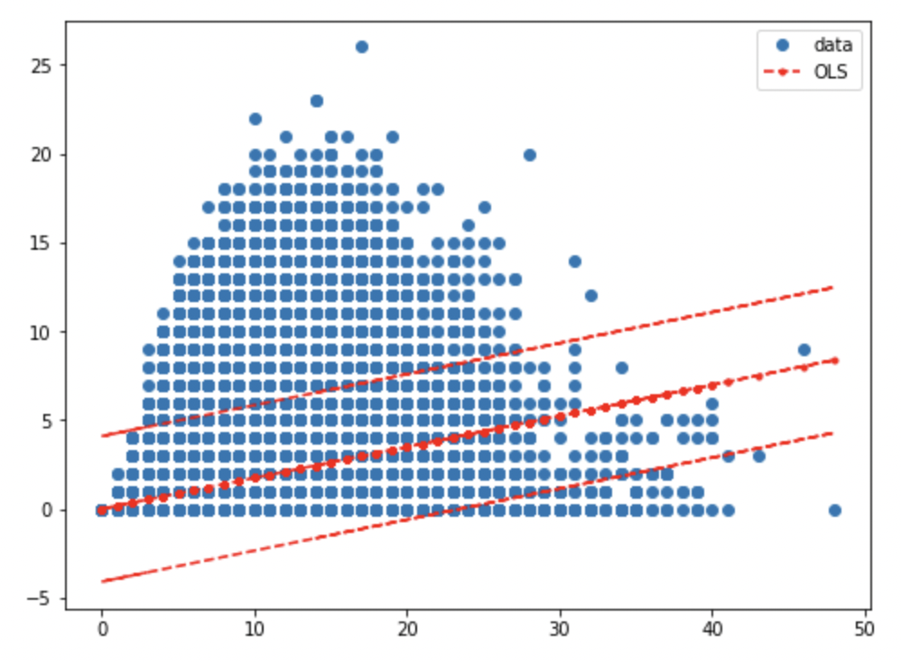
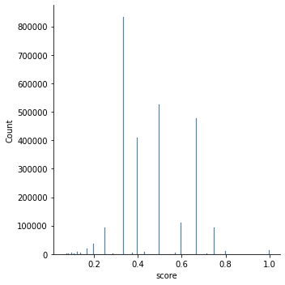

# Conflict Event Knowledge Graph 

## RDF/S Model
### Overall Schema



[Codes](https://github.com/siebeniris/ConflictEventKG)

[Data](https://shrtm.nu/6ybL)

[Documentation](images/documentation.html)
## Analysis

* Correlation Analysis of the number of detected entities and the number of detected events

  * No linear correlation.
  




* Distribution of the event detection confidence score



## Sparql Queries

* The following query shows the events with the highest popularity and with role and actors of the events.

```sparql
prefix cekg: <https://siebeniris.github.io/ConflictEventKG/>
prefix dcterms: <http://purl.org/dc/terms/>
prefix sem: <http://semanticweb.cs.vu.nl/2009/11/sem/> 

select  ?date  ?EventDescription ?RoleType ?Actor (count(?tweet) as ?NumOfTweets) 
where {
?tweet cekg:detected ?event.
?event dcterms:description ?EventDescription;
            sem:hasBeginTimeStamp ?date.
?relation rdf:object ?event; sem:roleType ?roletype; rdf:subject ?actor.
?actor rdfs:label ?Actor.
?roletype rdfs:label ?RoleType.

} 
GROUP BY ?date ?EventDescription ?RoleType ?Actor
ORDER BY DESC(?NumOfTweets)
LIMIT 10
```

**Result**


