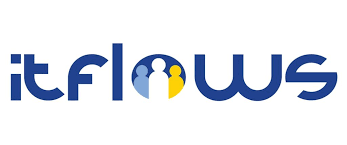

[//]: # (My Résumé: <a href="CV.pdf"> CV </a>)

## Academic Background
* I will join the [TypNLP](https://twitter.com/TypNLP) lab at Computer Science Department at University of Aalborg in Copenhagen, Denmark, in November.
* 11.2020-10.2022, [Junior Researcher, FIZ Karlsruhe, Karlsruhe Institute of Technology](https://www.fiz-karlsruhe.de/en/forschung/lebenslauf-und-publikationen-yiyi-chen), Karlsruhe, Germany
* 2018-2020, [Master in  Computational Linguistics and Computer Science](https://www.cis.uni-muenchen.de/ueber_uns/index.html) (1.67), Ludwig-Maximiliam-Universität München, Munich, Germany
* 2015-2018, [Bachelor in Computer Science and Computational Linguistics](https://www.ifi.lmu.de/front-page-en) (1.58), Ludwig-Maximiliam-Universität München, Munich, Germany
* 2008-2013, [Bachelor in Comparative Philosophy](http://philo.whu.edu.cn/), Wuhan University, Wuhan, China

### Industrial Work Experience

* 2018-2020, Working Student, NLP Engineer, [TrustYou GmbH](https://www.trustyou.com/), Munich, Germany

### Professional Academic Service

* 2022, Programme Committee Member, [PoliticalNLP 2022](https://sites.google.com/view/politicalnlp2022/home
  ), Co-located with 13th Edition of Language Resources and Evaluation Conference (LREC)

## Teaching Experience

* WS 2021-2022, Teaching assistant, Praktikum Information Service Engineering (Master), AIFB, Karlsruhe Institute of Technology, Germany
* WS 2021-2022, Teaching assistant, Seminar Representation Learning on Knowledge Graphs (Master) AIFB, Karlsruhe Institute of Technology, Germany
* SS 2021, Teaching assistant, Information Service Engineering, AIFB, Karlsruhe Institute of Technology, Germany
* SS 2021, Teaching assistant, Advanced Methods in Natural Language Processing: Metaphors (Master), AIFB, Karlsruhe Institute of Technology, Germany

## Supervision Experience

### Seminar Course

* 2022, Yi Xu, Representation Learning on Knowledge Graphs (Master), Paper Title: “ReInceptionE: Relation-Aware Inception Network with Joint Local-Global Structural Information for Knowledge Graph Embedding”
* 2022, Florian Krüger, (co-supervisor with Dr. Mehwish Alam), Representation Learning on Knowledge Graphs (Master), Paper Title: “K-Adapter: Infusing Knowledge into Pre-Trained Models with Adapters”
* 2021, Fabio Ritzi, Advanced Methods in Natural Language Processing: Metaphors (Master),  Paper Title: “How to Avoid Sentences Spelling Boring? Towards a Neural Network Approach to Unsupervised Metapher Generation (Yu and Wan, 2019)”

### Project Courses

* 2022, Vjola Cili, Mona Stebner, Philipp Kiesling, Praktikum Information Service Engineering (Master)- Make more out of less in low-resource languages, Paper Title: “A Quantitive Study on the Influence of Language Similarity in Cross-Lingual Transfer Learning”
* 2022, Caroline Berg, Nabil Aït Saïd, Nico Aßfalg, (co-supervisor with Russa Biswas), Praktikum Information Service Engineering (Master)- Multilingual Entity Type Prediction, Paper Title: “Multilingual Entity Type Prediction in DBpedia via Text Analysis”

## Projects

__ITFLOWS H2020, European Project__

* [https://www.itflows.eu/](https://www.itflows.eu/)
* __Description__: The purpose of ITFlows is to provide accurate predictions and adequate management solutions of migration flow in the European Union during the phases of reception, relocation, settlement, and integration of migrants. These insights will be provided with the help of EUMigraTool and precise models. Start Date: September 2020.

### Deliverables

* Mehwish Alam & __Yiyi Chen__ , Haithem Afli, February/2022, [Manual for Software Prototype of Social Media Analysis Tool to Monitor Public Attitudes Towards Migration](https://www.itflows.eu/wp-content/uploads/2022/06/27.-D5.3-ITFLOWS.pdf)
* Mehwish Alam & __Yiyi Chen__, Tobias Heidland & Finja Krueger, February/2022, [Analysis of the role of contextual factors and dynamics of attitudes on social media, especially hate speech](https://www.itflows.eu/wp-content/uploads/2022/06/28.-D5.4-ITFLOWS.pdf)

[//]: # ()
[//]: # (## Notes )

[//]: # ()
[//]: # (### Set up M1 Max for Deep Learning)

[//]: # ()
[//]: # (More Detaill: [https://siebeniris.github.io/M1MAX/]&#40;https://siebeniris.github.io/M1MAX/&#41;)

[//]: # ()
