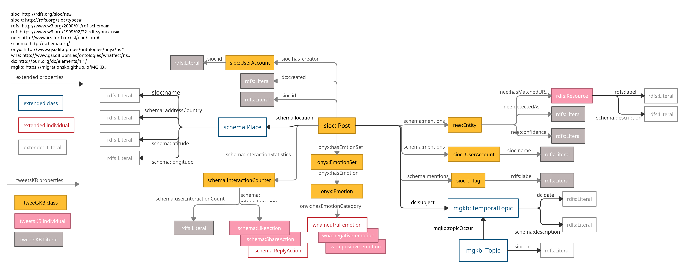
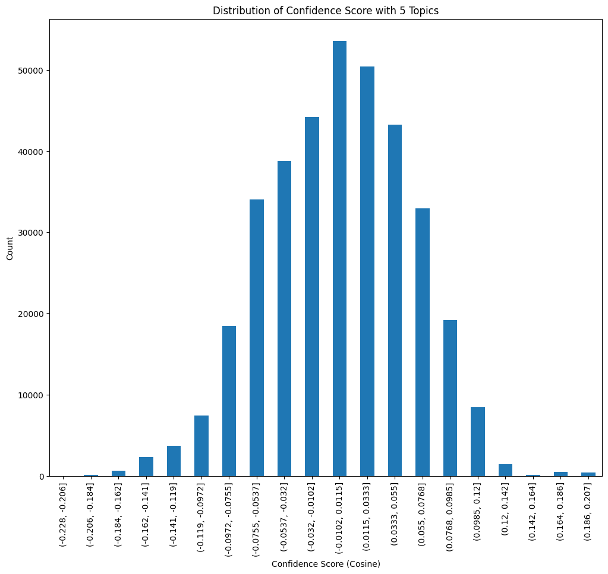
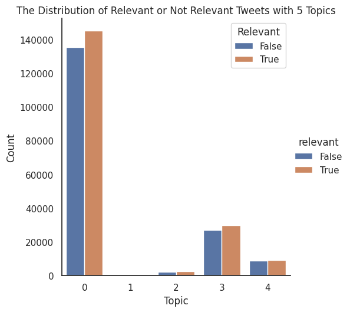
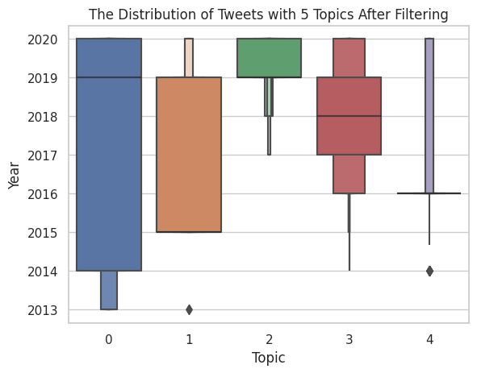
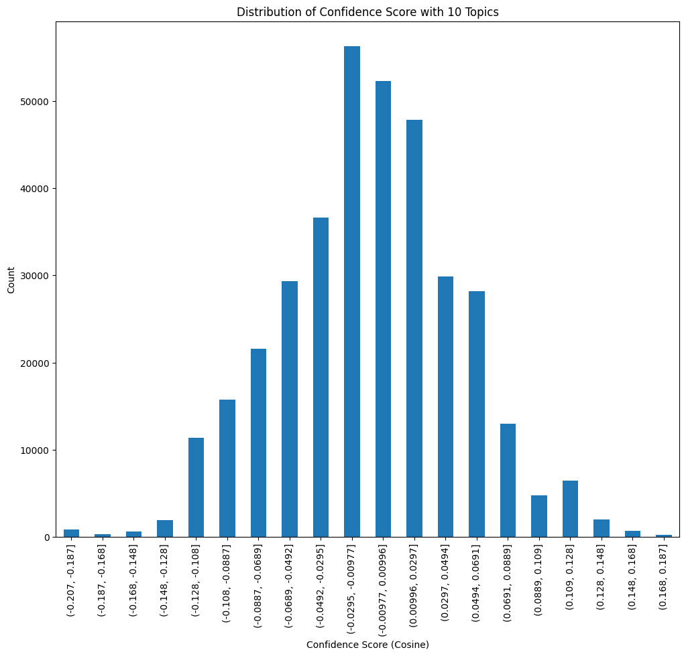
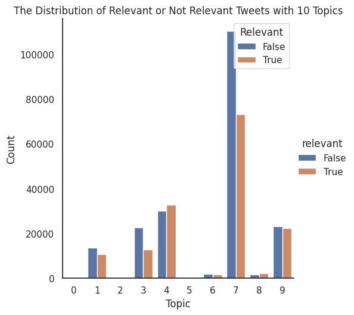
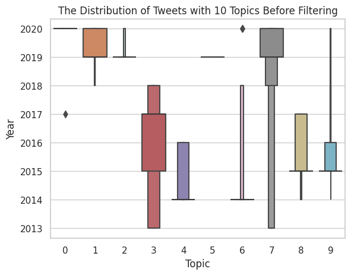
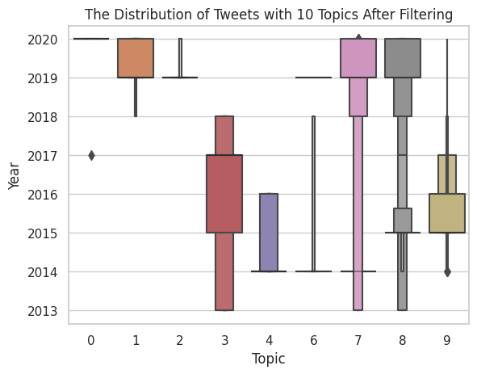

# Temporal Evolution of the Migration-related Topics on Social Media

## Introduction

This poster focuses on capturing **the temporal evolution of migration-related topics on relevant tweets**. 
It uses **Dynamic Embedded Topic Model (DETM)** as a learning algorithm to perform a quantitative
and qualitative analysis of these emerging topics. TweetsKB is extended
with the extracted Twitter dataset along with the results of DETM which
considers temporality. These results are then analyzed and visualized for
further analysis. It has shown that **the evolution of migration-related topics over time aligns with historical events**. 

## RDF/S Model
### Overall Schema

## Statistics of Tweets Classified with Topics

* Statistics of Tweets Classified with Model with 5 Topics

  

  
 

* Statistics of Tweets Classified with Model with 10 Topics

 

 

More Statistics of Tweets Classified with Models with other numbers of Topics: [stats](stats.md)

## Distirbution of 