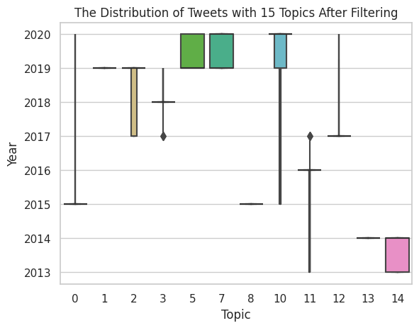
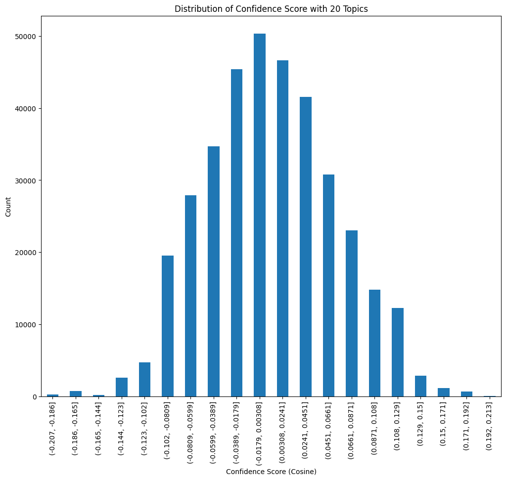

Go Back To [Homepage](https://siebeniris.github.io/)

## Statistics of Tweets Classified with Topics

* Statistics of Tweets Classified with Model with 15 Topics

  

* Statistics of Tweets Classified with Model with 20 Topics
  

* Statistics of Tweets Classified with Model with 20 Topics
  

* Statistics of Tweets Classified with Model with 25 Topics
  

* Statistics of Tweets Classified with Model with 50 Topics
  
  

* Statistics of Tweets Classified with Model with 75 Topics
  
  

  